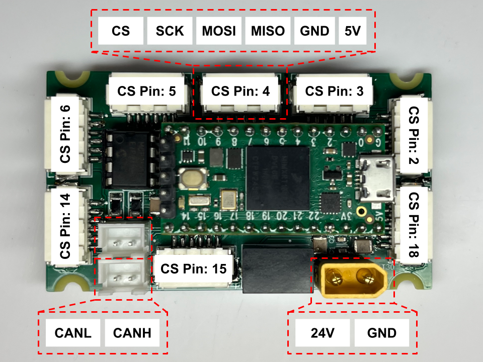

# Encoder & CAN Bus Testing for Palm Board
This is a platformio project for testing the palm board's CAN Bus and SPI Bus.



## Demo
In [main.cpp](src/main.cpp), the program will read an encoder and send random CAN messages for testing SPI and CAN Bus.

### 1. Read Encoders

In the [line 7 of main.cpp](https://github.com/NU-RDS/rds25-palm-board/blob/ac7c0db73b8326acae5b45e3641a6799e41232e1/src/main.cpp#L7):

```cpp
#define ENCODER1_CS 4 // CS Pin 4. This can be replaced with other CS Pins.
```

You can switch bwteen different ports by switching the CS Pin number within `14, 6, 5, 4, 3, 2, 18, 15` as shown in the image above.

The output is printed in the serial monitor.

### 2. Monitor CAN Messages

The program is sending random CAN messages on the CAN Bus. If you're using a [canable](https://canable.io) device on your Ubuntu laptop to monitor CAN messages, set it up:

```sh
sudo ip link set can0 up type can bitrate 1000000
```

Then monitor all messages on the CAN Bus:

```sh
candump can0
```